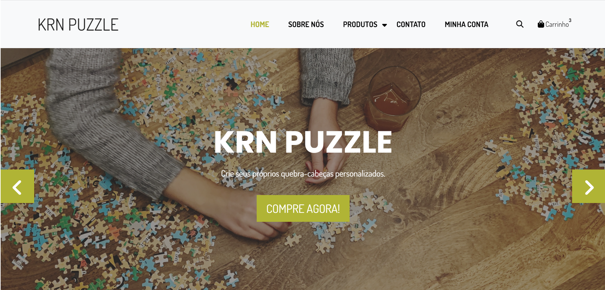

# Projeto de IHC: KRN Puzzle

Projeto desenvolvido durante a disciplina de Interação Humano-Computador do Curso Tecnologia em Análise e Desenvolvimento de Sistemas da UFPR. A ideia do site KRN Puzzle seria a venda de quebra-cabeças personalizados.

